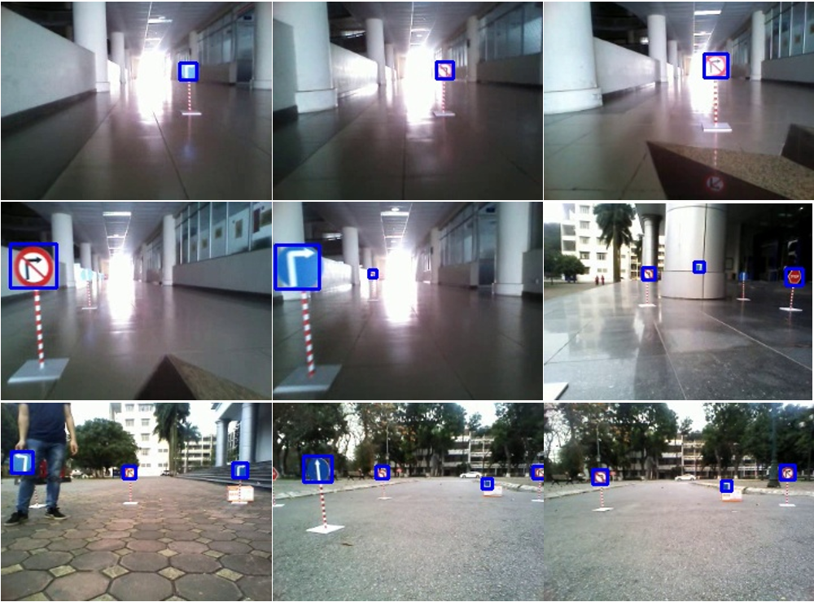

# via-trafficsign-detection

[English below]

## Progress

- [x] Data.

- [x] Backbone

    - [x] VGG-like.

    - [x] MobilenetV2.

- [x] Pretrained

    - [x] VGG-like.

    - [ ] MobilenetV2.

- [x] Inference code.

  
- [ ] Demo code.

    - [x] Demo kết quả trên ảnh.

    - [ ] Demo kết quả trên video.

## Installaition
### Requirements
- python>=3.7
- torch==1.7.0
- torchvision==0.8.1

### Install packages
Please execute below command to install essential packages
```
    $ conda install --file requirements.txt
```

## Training
```
    $ python train.py --train-image-dir=$TRAIN_IMAGE_DIR \
                      --train-label-dir=$TRAIN_LABEL_DIR \
                      --val-image-dir=$VAL_IMAGE_DIR \
                      --val-label-dir=$VAL_LABEL_DIR
```
Example
```
    $ python train.py --train-image-dir='via-trafficsign/images/train' \
                      --train-label-dir='via-trafficsign/labels/train' \
                      --val-image-dir='via-trafficsign/images/val' \
                      --val-label-dir='via-trafficsign/labels/val'
```
## Testing
```
    $ python inference.py --val-image-dir=$VAL_IMAGE_DIR \
                          --val-label-dir=$VAL_LABEL_DIR \
                          --checkpoint=$CHECKPOINT \
                          --outdir=$OUTDIR
```
Example
```
    $ python inference.py --val-image-dir='via-trafficsign/images/val' \
                          --val-label-dir='via-trafficsign/labels/val' \
                          --checkpoint='archives/centernet_vgg.ckpt' \
                          --outdir='result'
```

## Demo
```
    $ python demo.py --image-path=$IMAGE_PATH \
                     --checkpoint=$CHECKPOINT \
                     --outpath=$OUTPATH
```
Example
```
    $ python demo.py --image-path='samples/1.jpg' \
                     --checkpoint='archives/centernet_vgg.ckpt' \
                     --outpath='result/1.jpg'
```
## Pretrained model
Backbone | Parameters | Matmuls | Pretrained
| --- | ---: | ---: | :--- |
VGG-like | 2.5M | 24.47G | Link
Mobilenetv2 | 2.0M | 24.78G | N/A 

Download pretrained-models and put it in ```archives/``` directory. 

## Result


